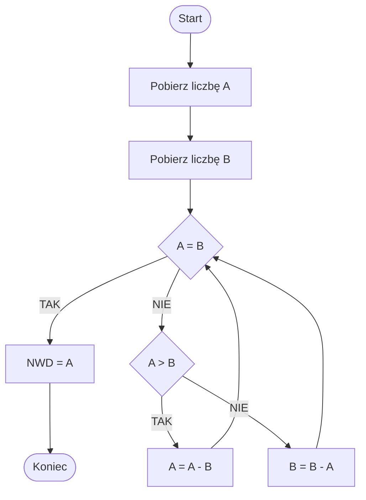

# NWD Największy Wspólny Dzielnik

```mermaid
graph TD;
  S([Start]) --> A;
  A["Pobierz liczbę A"] --> B;
  B["Pobierz liczbę B"] --> C{"A = B"};
  C --> |TAK| E;
  E["NWD = A"] --> K;
  C --> |NIE| F{"A > B"};
  F --> |TAK| G["A = A - B"]
  G --> C;
  F --> |NIE| H["B = B - A"]
  H --> C;
  K([Koniec])
```
