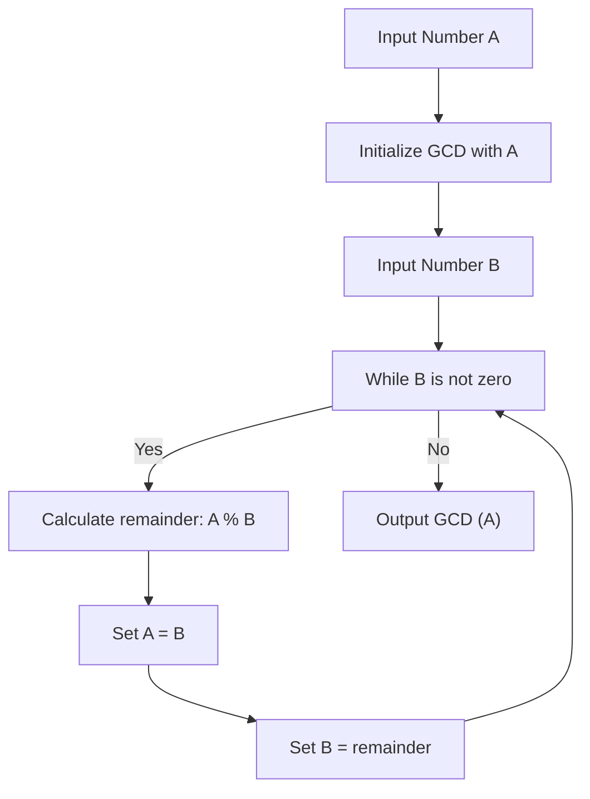

# mermaid

```mermaid
graph TD;
  A["Input Number A"] --> B["Initialize GCD with A"];
  B --> C["Input Number B"];
  C --> D["While B is not zero"];
  D --> |Yes| E["Calculate remainder: A % B"];
  E --> F["Set A = B"];
  F --> G["Set B = remainder"];
  G --> D;
  D --> |No| H["Output GCD (A)"];
```
